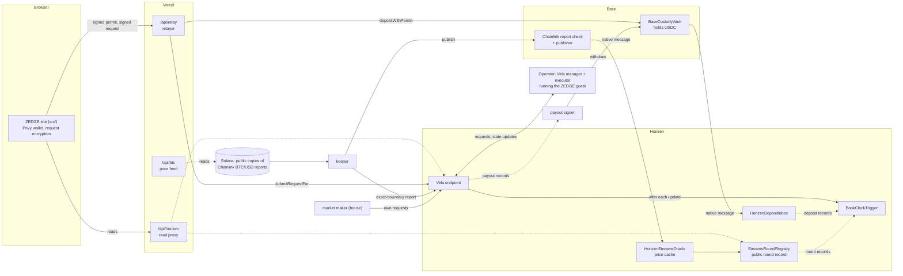

# ZEDGE

ZEDGE is a private order book for Bitcoin 15-minute Up/Down rounds. You deposit native USDC on Base into the ZEDGE vault, trade from a private balance, and withdraw back to Base. Orders are encrypted before they reach the public chain (Horizen, through a Vela application), so other users and chain observers cannot read them. Each round settles on Chainlink's BTC/USD Data Streams reports, and a public round registry on Horizen records every round.

Live at **https://zedge-markets.vercel.app**. A separate paper-trading demo with simulated funds is at [`?mode=demo`](https://zedge-markets.vercel.app/?mode=demo).

ZEDGE trades real USDC. Its contracts and engine have not had an independent security audit, and the operator can read every order and balance (see [Trust model](#trust-model)). Read the [Risk Disclosure](https://zedge-markets.vercel.app/risk-disclosure) and [Market Rules](https://zedge-markets.vercel.app/market-rules) before depositing.

## How a round works

- Every 15 minutes a new BTC round opens. Its opening and closing prices are the Chainlink BTC/USD reports for the exact boundary seconds. If one of those reports is missing, the round uses the round registry's record of that boundary instead.
- You buy Up or Down shares at 1 to 99 cents each, and can sell them back before the cutoff. Any part of an order that cannot fill at your price is cancelled.
- Trading stops 30 seconds before the round ends. When the order book's queue is busy, an order sent in the last minute before the cutoff can be refused.
- If the closing price is at or above the opening price, Up wins; otherwise Down wins. A winning share pays 1 USDC into your private balance, and a losing share pays nothing.
- A voided round pays 0.5 USDC per share, Up or Down. It does not refund the price you paid.
- The order book charges no trading fee.

## Architecture



**Site** ([`src/`](src)). A React and Vite app. Signing in with Google or X through Privy creates an embedded wallet; its address is your deposit address on Base. The site derives a trading key from one wallet signature, registers its public key with the order book, encrypts each request in the browser, and decrypts your receipts. It verifies the pinned deployment manifests in [`public/deployments/`](public/deployments) against both chains before showing round state. The paper demo and the help and policy pages (`/terms`, `/privacy`, `/risk-disclosure`, `/market-rules`, `/support`) are part of the same app.

**Vercel functions** ([`api/`](api) with logic and tests in [`server/`](server)).
- `/api/relay` is the relayer. It checks your Privy sign-in, your own EIP-712 signature and the exact request shape, then sends your USDC permit to the vault on Base, or your key registration or encrypted request to the Vela endpoint on Horizen. It pays the gas and the request fee. It never signs for you, and it rate-limits per user and overall. By default it serves only invited accounts.
- `/api/btc` serves recent Chainlink BTC/USD prices, read from public Solana transactions, for the chart and the displayed fair value. It does not settle anything.
- `/api/horizen` is a read-only Horizen RPC proxy for the site: allowed methods only, this site's origin only, and a per-visitor budget.

**Matching engine** ([`engine/`](engine)). A deterministic Go ledger for fully collateralized binary shares: deposits, complete-set mint and merge, separate Up and Down books with price-time priority, partial fills, GTC and IOC orders, reservations, settlement, voids, withdrawals and round archival. It has no clock, network access or randomness: time and identity come from the adapter that calls it. See [engine/README.md](engine/README.md) and the command schema in [`protocol/`](protocol).

**Vela guest** ([`adapters/vela/guest/`](adapters/vela/guest)). The engine and a Vela adapter, compiled with TinyGo to a WebAssembly module that Horizen's Vela executor runs. It checks request envelopes, stages book commands until the next chain-time tick, credits Base deposits from the inbox exactly once, publishes payout records for withdrawals, verifies Chainlink report signatures itself, and pads every request and receipt to fixed lengths. Its README is the protocol specification, including what is public and what is trusted.

**Client crypto** ([`adapters/vela/crypto/`](adapters/vela/crypto)). The TypeScript side used by the site and the services: key derivation bound to the deployment, request encryption with Horizen's Vela SDK, the canonical command encoder, request padding and decoders for the guest's public records. Both languages check one shared set of test vectors.

**Contracts** ([`contracts/`](contracts), Foundry).
- On Base: `BaseCustodyVault` holds deposited USDC, numbers each deposit and pays withdrawals signed by the payout signer, within per-payout and daily caps. `ChainlinkStreamsBoundaryOracle` verifies a Chainlink Data Streams report for an exact round boundary through Chainlink's verifier, and `BaseStreamsPublisher` sends the verified price to Horizen over Horizen's native messenger.
- On Horizen: `HorizenDepositInbox` records each vault deposit once for the order book. `HorizenStreamsOracle` caches prices that arrive from the publisher. `StreamsRoundRegistry` schedules, opens, resolves and voids rounds, and is the public record.
- The order book's clock trigger, `BookClockTrigger`, is in [`adapters/vela/stack/contracts/`](adapters/vela/stack/contracts). The Vela endpoint calls it after each state update, and it answers with the chain time, new deposit records from the inbox and round records from the registry. It holds no tokens.
- The tree also holds earlier Pyth-based contracts and a public ERC1155 outcome vault. Neither is part of the live system.

**Keeper** ([`services/keeper/`](services/keeper)). At each boundary it takes the exact-second Chainlink report, from the free copies in public Solana transactions or from Chainlink's paid API, and sends it to the order book, where the guest resolves the round, pays winners and opens the next round in one transition. It also publishes the report through the Base contracts so the registry records the round, and creates, opens, resolves or voids registry rounds as their rules require. Every call it makes is permissionless.

**Payout signer** ([`services/payout-signer/`](services/payout-signer)). Reads the guest's public payout records on Horizen and accepts only records from a completed state update of this application. It checks the destination, the amount and the vault's caps, then signs the payout and sends `withdraw` to the vault on Base, paying the gas. The vault pays each payout once.

**Market maker** ([`services/market-maker/`](services/market-maker)). The house liquidity bot. It quotes a bid and an ask on both Up and Down each round from a fair value based on the BTC spot price, the round's opening price and recent volatility, and pulls its quotes before the cutoff. It sends its own requests and pays its own gas; it does not use the relayer.

**Container images** ([`deploy/railway/`](deploy/railway)). One Node image runs the keeper, the payout signer or the market maker. The operator runs Horizen's Vela manager and executor images, pinned by digest and unmodified; the manager's container adds a small RPC guard that makes its transaction sends idempotent.

**Scripts, security and research.** [`scripts/`](scripts) builds the WebAssembly, writes the public deployment manifests, runs the protocol conformance check and holds the browser checks and the keeper rehearsal on local forks. [`security/`](security) holds the internal review records, and [`research/`](research) the design research.

## Money flow

| Step | What happens | Who pays gas |
| --- | --- | --- |
| Fund | Send native USDC on Base to your deposit address (your Privy wallet). USDC on other networks and other tokens are not credited. | You, from wherever you send it |
| Deposit | Your wallet signs a USDC permit. The relayer calls `depositWithPermit`; the vault takes 1 to 500 USDC, numbers the deposit and sends a native message to the Horizen inbox. | Relayer |
| Credit | On the next tick the trigger hands new inbox records to the guest, which credits each deposit to your private balance exactly once, or refunds it to Base if it cannot be credited. This usually takes about a minute. | Keeper and operator |
| Trade | Your browser encrypts the order and pads it to 2,048 bytes, and your wallet signs the request. The relayer submits it to the Vela endpoint. The guest stages it and applies it at the next tick's chain time. Your receipt comes back encrypted to your key. | Relayer (gas and request fee) |
| Settle | At the boundary the keeper sends the Chainlink report. The guest checks the signatures, resolves the round and pays winning shares into private balances. If that report does not arrive, the round settles from the registry's record. | Keeper |
| Withdraw | You send a private withdrawal request through the relayer. The guest publishes a payout record. The payout signer checks it and the vault pays USDC to your address on Base, up to 1,000 USDC per withdrawal. | Relayer, then payout signer |

The operator pays for every state update on Horizen. Once your USDC is at your deposit address, you pay no network fees.

## What is public and what is private

| Anyone reading Base and Horizen can see | Encrypted on chain (readable by you and the operator) |
| --- | --- |
| Deposits and withdrawals on Base, with addresses and amounts; a withdrawal names the account and the destination | Your orders and cancellations |
| Which addresses send requests to the order book, and when | Your balance and positions |
| Each round's prices, result and settlement records | Your fills and receipts |
| Every request and receipt, at one fixed length, and each new state root | |

Encryption does not hide this metadata or your network traffic. Some smaller channels remain, such as timing and certain refusal reasons; the guest README lists them under "Residual channels" in section 11.

Off chain, the relayer logs each request's type and your wallet address, and Privy, the RPC providers and the web host receive ordinary request data such as your IP address. The [Privacy Policy](https://zedge-markets.vercel.app/privacy) has the details.

## Trust model

- **The operator can read everything private.** The operator runs the Vela manager and executor that hold the order book, and can read every order, balance, position and fill for every account. The public cannot.
- **Nothing proves which code ran.** The executor does not run on attested hardware. On this Vela version the manager also supplies the sender, the time and the deposit records the guest sees, so it could impersonate an account, hold back the clock or credit a deposit that never happened. The guest publishes a hash of every trusted input it applied, so a forged input can be proven afterwards, but nothing prevents it. Details: the guest README, "What is trusted or unproven".
- **The operator controls custody.** It signs every withdrawal and owns the vault. Nothing in the software stops the operator from misusing that access.
- **Payout caps.** The vault pays at most 1,000 USDC per withdrawal and 10,000 USDC per UTC day in total. The caps limit what a compromised signer can take in a day, and they mean a withdrawal can wait.
- **Upgradeable contracts.** The vault, the deposit inbox, the round registry and the clock trigger are upgradeable proxies, and their owner can replace their code. The three contracts that verify and deliver prices cannot be upgraded; they rely on Chainlink's verifier and the networks' messenger contracts.
- **The house is the operator.** The operator trades as the house and is often the other side of your trade. Stake limits apply to each account in each round and to all accounts together at each closing time. The house is exempt from both and has its own total limit.
- **Forced voids.** Anyone willing to pay network fees can hold back price delivery long enough to void a round, which halves what winning shares pay (see the [Market Rules](https://zedge-markets.vercel.app/market-rules)). The all-accounts stake limit caps how much one closing time can move.
- **Availability.** If the engine, the relayer, the keeper or either network stops, orders, settlement, deposits and withdrawals stop until it recovers. If the operator's engine data were lost, private balances might not be recoverable.
- **Current limits.** One market (BTC, 15-minute rounds), at most 32 accounts in the current application, deposits of 1 to 500 USDC. The full list is under "Limits" in the guest README.

## Repository layout

| Path | Contents |
| --- | --- |
| [`src/`](src) | React site: live market (`chain/`), paper demo (`lib/`, `components/`), help and policy pages (`pages/`) |
| [`api/`](api), [`server/`](server) | Vercel functions (relayer, BTC price feed, Horizen read proxy) and their logic and tests |
| [`engine/`](engine) | Go matching engine and ledger |
| [`adapters/vela/guest/`](adapters/vela/guest) | Vela guest (TinyGo WebAssembly) and its protocol specification |
| [`adapters/vela/crypto/`](adapters/vela/crypto) | TypeScript key derivation, encryption, command encoding and padding |
| [`adapters/vela/stack/`](adapters/vela/stack) | Local Vela stack test harness and the `BookClockTrigger` contract |
| [`contracts/`](contracts) | Solidity contracts, ABIs, deployment records and deployment scripts |
| [`protocol/`](protocol) | Engine command and configuration JSON schemas |
| [`services/`](services) | Keeper, payout signer and market maker |
| [`deploy/railway/`](deploy/railway) | Container images for the services and the operator |
| [`scripts/`](scripts) | WebAssembly build, manifest writers, protocol conformance, browser checks, keeper rehearsal |
| [`public/deployments/`](public/deployments) | Public deployment manifests read by the site and the services |
| [`security/`](security) | Internal review and verification records |
| [`research/`](research) | Design research |

## Deployed contracts

Everything runs on Base mainnet (chain ID 8453) and Horizen mainnet (chain ID 26514). Contract addresses, code hashes and owners are in the public manifests, which the site checks against the chains:

- [`public/deployments/26514-orderbook.json`](public/deployments/26514-orderbook.json): the Vela endpoint, the application and its WebAssembly hash, the clock trigger, the Base vault, the Horizen inbox, the vault's limits and the stake limits.
- [`public/deployments/26514.json`](public/deployments/26514.json): the round registry, the Horizen price cache and the Base report contracts, with their upstream dependencies.

The deployment history is in [contracts/deployment/MAINNET.md](contracts/deployment/MAINNET.md).

## Run the site locally

Use Node.js 22.12 or newer (CI uses 22.22.2).

```sh
npm ci
npm run dev        # http://127.0.0.1:4188/
```

The live market reads Horizen and Base through public RPC endpoints. Vite does not serve the `api/` functions, so locally the price chart has no data and requests cannot be relayed. Sign-in stays closed unless the build sets a Privy app ID (`VITE_PRIVY_APP_ID`). The paper demo at `http://127.0.0.1:4188/?mode=demo` needs no network services.

```sh
npm run build && npm run preview   # production build, same port
```

## Tests

```sh
npm run check                                   # lint, site and server tests, production build, build-output check
npm run test:keeper
node --test services/market-maker/*.test.mjs
node --test services/payout-signer/*.test.mjs
npm run test:engine                             # Go 1.25 or newer (CI uses 1.27): race tests and vet
(cd adapters/vela/guest && go test ./...)       # guest, native tests
npm --prefix adapters/vela/crypto ci && npm run test:crypto
bash contracts/scripts/install-deps.sh && npm run test:contracts   # Foundry 1.7
forge build --root contracts && npm run test:protocol              # local EVM rounds against the engine (needs anvil and Go)
```

The guest's WebAssembly and upstream conformance tests skip until the module is built with the pinned toolchain; see [adapters/vela/guest/README.md](adapters/vela/guest/README.md#build-and-test).

## Continuous integration

[`.github/workflows/ci.yml`](.github/workflows/ci.yml) runs on every push and pull request:

- **frontend**: `npm run check`, the keeper, market maker, payout signer and deployment-script tests, and `npm audit`.
- **engine**: `gofmt`, `go vet`, race tests, two fuzz targets and `govulncheck`.
- **contracts**: `forge fmt`, build with sizes, tests, an ABI drift check, `npm audit` and Slither.
- **sdk-crypto-evaluation**: the client crypto tests and `npm audit`.
- **vela-guest**: the guest's native Go tests and the clock trigger's Foundry tests.
- **protocol-conformance**: local EVM rounds through the real registry, with native and TinyGo WebAssembly results compared.
- **secrets**: Gitleaks over the full history.

[`.github/workflows/codeql.yml`](.github/workflows/codeql.yml) runs CodeQL for JavaScript/TypeScript and Go on every push and pull request and weekly. Dependabot checks npm, Go modules and GitHub Actions weekly.

## Security

Report vulnerabilities privately through this repository's **Security → Report a vulnerability** page. See [SECURITY.md](SECURITY.md). Never send a seed phrase or private key, and do not test against another user's account or funds.

## Licence and third-party notices

This repository does not include a licence file. [THIRD_PARTY_NOTICES.md](THIRD_PARTY_NOTICES.md) covers React, Phosphor icons, the Manrope and IBM Plex Mono fonts and TradingView Lightweight Charts; the React, Phosphor and font licence texts are in [`public/licenses/`](public/licenses). Horizen's Vela SDK is an npm dependency, and the operator runs Horizen's published Vela images; no upstream Vela source is copied into this repository.

## Further reading

| Document | Covers |
| --- | --- |
| [adapters/vela/guest/README.md](adapters/vela/guest/README.md) | The order-book protocol: envelopes, ticks, deposits, payouts, Chainlink checks, privacy, trust and limits |
| [adapters/vela/crypto/README.md](adapters/vela/crypto/README.md) | Client key derivation and encryption |
| [adapters/vela/stack/README.md](adapters/vela/stack/README.md) | The local Vela stack test harness |
| [engine/README.md](engine/README.md) | Engine API, matching, units and fees, limits and verification |
| [protocol/README.md](protocol/README.md) | Engine command protocol |
| [contracts/README.md](contracts/README.md) | Contracts, registry rules and custody |
| [contracts/deployment/MAINNET.md](contracts/deployment/MAINNET.md) | Mainnet deployment record |
| [services/keeper/README.md](services/keeper/README.md) | Round keeper |
| [services/payout-signer/README.md](services/payout-signer/README.md) | Payout signer |
| [services/market-maker/README.md](services/market-maker/README.md) | House market maker and its pricing |
| [security/README.md](security/README.md) | Verification record |
| [security/WHOLE-SYSTEM-REVIEW.md](security/WHOLE-SYSTEM-REVIEW.md) | Internal whole-system review |
| [research/README.md](research/README.md) | Design research |
