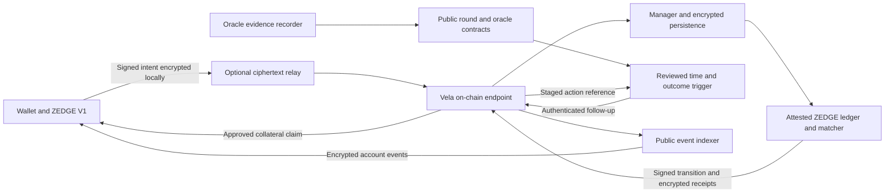

# ZEDGE confidential prediction markets: research and build decisions

**Reviewed 2026-10-04.** Three parallel research tracks covered Vela's implementation, private prediction-market architecture, and Horizen's infrastructure/funding. The reports distinguish published capabilities, source observations, proposed ZEDGE behavior, and unresolved dependencies. Source inspection and read-only RPC checks are not a security audit.

**Decision:** retain the selected ZEDGE V1 interface and build an original, deterministic, fully collateralized prediction-market engine. Isolate Vela behind an integration boundary. Use Vela first for encrypted orders, account state, and participant receipts in an approved test environment. Production activation depends on the gates below.

The current public application remains a paper-trading prototype. Implementation has started in [contracts](../contracts/README.md), [engine](../engine/README.md), the isolated chain interface, the [public round keeper](../services/keeper/README.md), SDK crypto evaluation and an [evaluation-only Vela guest](../adapters/vela/guest/README.md) run on Horizen's local Vela stack. See the [security/implementation record](../security/README.md) for actual work and unresolved boundaries. This research itself does not establish a deployed private exchange.

## Read the research

| Report | What it resolves |
| --- | --- |
| [Vela protocol feasibility](vela-protocol.md) | Pinned releases and libraries, licensing, attestation, privileged roles, metadata, encryption keys, recovery, SDK discrepancies, and available deployment evidence. |
| [Private order book architecture](private-orderbook-architecture.md) | Matching and collateral model, privacy boundary, authenticated order timing, oracle rules, exits, financial invariants, and adversarial tests. |
| [Horizen ecosystem and Builder Fund](horizen-builder-program.md) | The requested fund page and `#why` section, application categories, infrastructure, USDC.e, oracle dependencies, budget inputs, and grant milestones. |
| [Product requirements and interaction inventory](product-requirements.md) | Screens, feature priorities, dialogs, small interactions, failure states, and acceptance criteria for the prediction-market platform. |
| [Deployment preflight](deployment-preflight.md) | Live oracle availability, Chainlink alternatives, collateral proxy identity and source-verification readiness. |
| [Mainnet deployment record](../contracts/deployment/MAINNET.md) | Confirmed Horizen price cache and Base Chainlink verification/publication contracts, the registry retired on 2026-10-05 and its planned replacement, transaction evidence and remaining integration work. |
| [Chainlink Streams on Base](chainlink-streams-base.md) | Exact feed IDs, precision, verifier governance, and genuine signed-report checks. |
| [Horizen-first native oracle route](hybrid-chain-routing.md) | Base verification with native authenticated delivery to the Horizen price cache that the registry reads, and the 2026-10-05 note on delivery that can be priced out. |
| [Deployment gas snapshot](deployment-costs.md) | Scoped estimates for the two original contracts, distinct from a complete exchange launch budget. |

## Findings that change the build

| Finding | Evidence | Decision for ZEDGE |
| --- | --- | --- |
| Vela is documented as local/testnet software; a supported mainnet service was not established. | [Official roadmap](https://docs.horizen.io/vela/roadmap/) | Separate a test integration from any real-money launch. Obtain a supported deployment manifest. |
| Reviewed components use BSL 1.1. Its baseline grants non-production rights; the Additional Use Grant describes evaluation/testing and grants no production use. | [Pinned SDK license](https://github.com/HorizenOfficial/vela-common-ts/blob/c9d28e4107d08ed4a570449a577ac07089891344/LICENSE) | Obtain applicable production permission before using restricted dependencies in production. Keep original exchange logic independent. |
| Vela's TEE executes specified code confidentially; attestation is not a proof of correct financial rules. | [Vela introduction](https://docs.horizen.io/vela/introduction/) | Audit the ledger, matching, oracle, client, and custody integration in addition to the platform. |
| On-chain requests disclose sender/facilitator and funding metadata. | [Pinned request definitions](https://github.com/HorizenOfficial/vela/blob/335724c95ba7b58d64ec97bbb67d18640123278e/contracts/contracts/Structs.sol) | Promise confidential order contents and account state, with clear public metadata disclosures. |
| The guest ABI lacks an authenticated chain-time parameter, and manager-to-executor request binding needs further assurance. A historical checkpoint alone does not enforce a commitment deadline. | [Guest invocation](https://github.com/HorizenOfficial/vela/blob/335724c95ba7b58d64ec97bbb67d18640123278e/pkg/wasm/wasmtime_runtime.go), [executor validation](https://github.com/HorizenOfficial/vela/blob/335724c95ba7b58d64ec97bbb67d18640123278e/pkg/executor/executor.go#L522) | Treat the proposed trigger/checkpoint admission flow as an integration hypothesis requiring review and tests. |
| Claims withdraw already credited pending claims; they do not independently release an arbitrary private account balance during an operator outage. | [Endpoint custody and claims](https://github.com/HorizenOfficial/vela/blob/335724c95ba7b58d64ec97bbb67d18640123278e/contracts/contracts/ProcessorEndpoint.sol) | Resolve recovery and emergency exits before accepting real collateral. |
| An upstream design document estimates about 30 requests/minute for sequential processing on a two-second chain. This is not a benchmark or SLA. | [Batch execution analysis](https://github.com/HorizenOfficial/vela/blob/335724c95ba7b58d64ec97bbb67d18640123278e/docs/design/BATCH_EXECUTION.md) | Benchmark the full order/cancel workload; do not promise exchange-scale continuous matching on the current path. |
| No version-scoped public Vela audit was located; Horizen's existing bounty explicitly excludes Vela. | [Published bounty scope](https://immunefi.com/bug-bounty/horizen/scope/) | Request actual audit scope and remediation evidence, rather than inheriting another product's security claims. |

These findings are release dependencies, not a claim that an exploit was demonstrated or that a private commercial deployment cannot exist.

## Product contract

ZEDGE trades **binary outcome shares**, initially BTC and ETH finishing at or above an opening reference over 5-minute or 15-minute rounds. Under a valid resolution, one winning share redeems for one collateral unit; a losing share redeems for zero. A collateral unit is not a guarantee of a stablecoin's dollar peg. Tie behavior, fees, any void exception, oracle source, and deadlines must be disclosed before trading.

The first complete vertical slice is one **BTC 15-minute** round with a clearly labeled test collateral. It includes deposits, complete-set mint/merge, funded limit and protected immediate-or-cancel orders, partial fills, cancellation, expiry, canonical resolution, redemption, and withdrawal. The final launch scope remains BTC/ETH × 5m/15m.

Start with separate Up and Down books using maker-price execution and price/time priority. Minting one Up plus one Down requires one collateral unit. Buyers receive existing inventory from funded sellers; sellers must own unreserved shares. Use integer accounting, cumulative fee rounding, idempotent commands, and a reproducible transition log. The [architecture report](private-orderbook-architecture.md#matching-collateral-and-conservation) defines the conservation properties.

Funded liquidity providers are a launch dependency. Simulated depth, quote-crossing fills, and a seeded demo account cannot become live liquidity merely by adding encryption.

## Privacy and interface behavior

Our proposed first release has the following deliberate information policy:

| Area | Proposed behavior |
| --- | --- |
| Orders | Encrypt side, limit, size, expiry, and account intent in the browser for the approved enclave. Display each user's exact orders privately. |
| Book display | Publish defined bid/ask quotes with timestamp and validity limits. Withhold individual resting orders and full exact depth. Add coarse, delayed depth only after leakage testing. |
| Quotes and fills | A public quote can become stale and is not a reserved execution guarantee. Submit a protected price-limited order; distinguish pending, accepted, partial, filled, and rejected. |
| Balances and portfolio | Private cash, reservations, inventory, and receipts live in confidential state. Deposits, withdrawals, and wallet/request metadata retain public chain footprints. |
| Charts | Show a fast display feed with freshness indicators and separately identify the settlement source and opening price. A moving ticker is not evidence of order completion. |
| Cancellation | Show `Cancel requested` until an authoritative result. A fill sequenced before cancellation remains valid. |
| Key recovery | Separate an unreadable encrypted receipt from an empty account/history. Account association and historical decryption require explicit key-epoch handling. |
| Privacy status | Derive status from the verified deployment, measurement, application fingerprint, and encryption path. A software emulator must be visibly labeled. |
| Disclosure | Define report fields, retention, who can authorize access, and governing keys. Do not expose plaintext orders to analytics, logs, or support tooling. |

Later candidates are confidential conditional orders, private liquidity-provider inventory, scoped session authorization, and controlled account reporting. Each needs its own input, leakage, and authorization review. Conditional orders also increase authenticated price-update demand. Wallet unlinkability and hidden deposits/withdrawals would require additional protocol work beyond the reviewed Vela flow.

## Proposed system boundary

This is a proposed design. Trigger authentication, request binding, queue ordering, and recovery remain gates. Callback failure does not roll back an already accepted preceding state update, so an order must not match before the required admission checkpoint succeeds. [Trigger behavior](https://docs.horizen.io/vela/reference/trigger-contracts/)

Even a valid pre-cutoff checkpoint can arrive after the outcome is observable. The protocol must enforce a reviewed commitment deadline or explicitly define deterministic checkpoint-time execution, including delayed confirmations and cancellations, without a hindsight option. The two-phase sketch alone does not solve that problem. Contract acceptance of either queue head also means normal manager scheduling is insufficient as the fairness rule; see the [timing analysis](private-orderbook-architecture.md#input-integrity-and-clock-gap).

Vercel can host the public interface and suitable stateless services. Confidential computation requires the supported Nitro deployment; a normal web API is not that privacy boundary. The relay, indexer, and oracle recorder must never receive user decryption keys. An operator may still observe network metadata or affect service availability.

### Implementation boundaries

These are proposed modules, not directories or services already implemented:

| Module | Responsibility | Dependency policy |
| --- | --- | --- |
| `protocol/` | Market rules, versioned commands, signed domains, private/public event schemas, cross-language fixtures. | Original specification. Explicit integer bounds and canonical encoding. |
| `engine/` | Pure Go ledger, reservations, matcher, lifecycle, redemption and fee accounting. | No network, system clock, database or Vela imports. Verify compatibility with the selected TinyGo/WASI toolchain. |
| `adapters/vela/guest/` | Map the reviewed WASM ABI into validated core commands. (As built on 2026-10-05: an evaluation-only guest covering deployment, deposits, withdrawals, claims and a trusted clock tick, run on the local v0.2.0 stack with a software enclave, no attestation and a test token; order-book commands and round mirroring are designed, not built. See its [README](../adapters/vela/guest/README.md) and the [stack slice](../adapters/vela/stack/README.md).) | Pinned evaluation dependencies until production rights and environment are established. |
| `adapters/vela/client/` | Deployment verification, key lifecycle, encryption, submission, receipts and reconciliation. | Pin the actual SDK implementation; test documentation discrepancies explicitly. |
| `contracts/` | Immutable round definitions, oracle verification, admission trigger, and the selected custody/recovery integration. (As built: a round's terms are fixed at creation, but since 2026-10-05 the Streams registry is upgradeable by its owner; see the [contract README](../contracts/README.md#proxy-and-ownership).) | No fabricated deployed addresses. Review token allowlists and administrative roles. |
| `services/` | Ciphertext relay, public indexing, oracle evidence capture, aggregate publishing and health signals. | Secrets stay server-side; private trading inputs stay encrypted. |
| Existing React V1 | Tickets, charts, private account views, lifecycle states, disclosure and recovery entry points. | Browser state is a cache of verified results, never the financial authority. |

Use one confidential application containing many uniquely identified rounds. Chain/application identity, market rules, collateral, asset, duration and timestamps form replay domains. Cross-market concurrent requests must share consistent account reservations.

## Oracle decision is deliberately open

**Stork is the first integration candidate because Horizen documents it.** Its signed recent-price retrieval covers ten minutes, so a 15-minute round must record its opening evidence at the boundary. The trade-price chart and settlement oracle are separate product inputs. [Horizen integration](https://docs.horizen.io/horizen-chain/integrations/stork-oracle/), [Stork REST API](https://docs.stork.network/api-reference/rest-api)

A signature authenticates an observation; it does not by itself prove that a submitter chose the first eligible observation. Before selecting a provider, specify the exact opening/closing selection rule and prove how omitted or selectively chosen observations are handled. A trusted collector is an additional declared assumption, not equivalent to a unique historical observation proof.

The architecture report originally evaluated Pyth's fixed-time verification, conditional on actual target-network deployment and service access. Legacy Horizen EON support must not be substituted for support on the current Horizen L3. The subsequent approved route uses Chainlink Streams verification on Base and authenticated native messaging into a Horizen registry/cache; see the [mainnet deployment record](../contracts/deployment/MAINNET.md). The registry deployed on that route on 2026-10-04 is retired; its replacement is planned and not deployed. Continuous fresh report access and production integration remain release dependencies.

Market lifecycle: `scheduled → opening pending → trading → closed → resolution pending → resolved`, with a predeclared failure/void policy. Opening evidence must be fixed before funded orders become executable. Missing evidence cannot trigger an administrator-selected replacement after the outcome is known. The Streams registry's code keeps to this, but since 2026-10-05 its owner can replace that code, so the rule now depends on the owner key.

## Build sequence and acceptance evidence

| Milestone | Concrete deliverable | Acceptance evidence |
| --- | --- | --- |
| 1. Original exchange core | Versioned rules, complete-set ledger, matching, reservations, partial fills, cancellation, expiry, resolution and redemption. | Property/model tests preserve solvency after arbitrary command sequences. Replaying a log gives the same state and receipts. Tests cover fee rounding, overflow, duplicate operations and all cutoff equalities. |
| 2. Vela evaluation | Isolated software integration using dummy funds, pinned versions and a reviewed adapter. | Encrypt/submit/decrypt lifecycle works; wrong domains/keys and duplicate requests fail safely. Software-TEE limits are explicit. Applicable evaluation terms are checked. |
| 3. Attested testnet | Supported deployment, authenticating browser, original WASM, validated oracle/time path, and full BTC 15m lifecycle. | Inspect actual calldata/events/logs; exercise cancellation races, key rotation, trigger failure, restart/reorg and withdrawal. Obtain upstream assurance for unresolved request-binding behavior. |
| 4. Four-market capacity | BTC/ETH × 5m/15m, funded test counterparties, state growth and burst traffic. | Measure placement/cancel/settlement latency at p50/p95/p99, throughput, cost, backlog and failure recovery. Publish workload, hardware/version and queue settings with results. |
| 5. Production qualification | Applicable licenses, audited code/deployment, reviewed operating permissions, recoverable custody, governance, oracle contract and liquidity commitments. | Close audit findings and every gate below; rehearse state/key restoration and the selected emergency exit. |
| 6. Capped production pilot | Supported production environment with explicit limits and monitoring. | Reconcile actual collateral/liabilities, verify redemptions and withdrawals, measure retained users and organic executable volume. Raise caps only against evidence. |

Do not assign a mainnet date before deployment access, license terms and audit capacity are known. Select numerical service targets before the hardware benchmark. Derive the trading safety buffer from measured tail latency and the chosen confirmation policy; if it consumes too much of a five-minute round, revise the execution architecture before offering that market.

## Questions that close the production gates

The following is a prepared technical diligence agenda; it has not been sent to Horizen or used to submit an application.

1. **License and service:** What written permission covers the SDK, core, libraries, hosted pilot and production workload? Which Vela networks are supported now?
2. **Deployment identity:** Supply contract addresses, bytecode hashes, source tags, WASM ABI, enclave measurement, keys, governance roles, reset configuration, collateral allowlist and verifier dependencies.
3. **Input integrity:** How does the measured executor bind sender, token/amount, payload, request type, chain/endpoint domain and accepted sequence to the canonical request? Which authenticated time path is supported?
4. **Ordering:** Which queue rules are enforced by contracts versus the manager? How are priority, cancellation, starvation, censorship and late processing handled under load?
5. **Keys and recovery:** How are queued ciphertext, historical receipts, state versions, KMS policy and revoked measurements handled during rotation or loss? Can restoration reproduce the latest canonical root?
6. **User exit:** What releases a private account balance if normal execution stops permanently? What witnesses/data are available to users, and how are stale-state or duplicate claims prevented?
7. **Security evidence:** Which exact versions have independent audits, what findings remain, and what incident response or bounty scope covers this deployment?
8. **Capacity and cost:** What measured throughput, tail latency, queue/state bounds, recovery objectives and pricing apply to the actual environment?
9. **Oracle/collateral:** Is the chosen token accepted with its real decimals/permit behavior? Which verifier and timestamp-selection policy provide reproducible round outcomes?
10. **Funding:** Which application category fits ZEDGE, what evidence is required, and what fee contribution/support terms would apply? Grant approval cannot substitute for technical acceptance.

## Builder Fund positioning

Apply as a new private prediction-market project unless demonstrable deployments/users support another category. The official application indicates **$10–25k for new/wildcard projects**, versus higher ranges for complementary and core proposals; it expressly treats ranges as guidance. The largest advertised grant is not the default ZEDGE budget. [Official application preview](https://docs.google.com/document/d/1Eze2ufM-kXYnUaxKNRh_PunZsDvAR8Ggiz8j_rtm-Y8/edit)

Use three evidence-based funding outcomes: a confidential order lifecycle, independent security/recovery validation, and bounded real usage after launch gates. Budget original engineering, oracle/data capture, custody/contract review, client cryptography, infrastructure, audits and liquidity separately. Current UI work is a demo asset; it is not protocol traction. The [fund report](horizen-builder-program.md) documents payout structure, KYC, negotiated fee contributions and the requested privacy stack in detail.

## Review method and freshness

The protocol and architecture reports pin source commits, including Vela `v0.2.0`. The ecosystem report records timestamped read-only network observations. Follow-up peer review checked order timing, accounting and oracle-provider assumptions. No exploit testing, production transactions, vendor contact, application submission or funding commitment occurred.

Revalidate availability, terms, versions and deployment addresses before implementation against a hosted environment. Public-source unknowns should become written requirements and tests; they should never silently become assumed guarantees.
