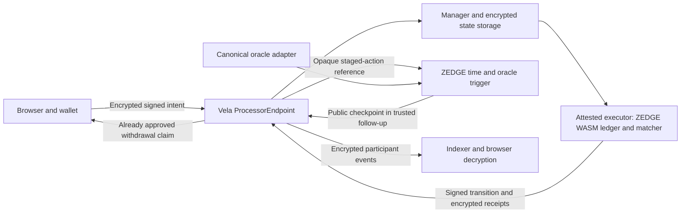

# ZEDGE: private order book architecture and production gates

Research access date: **2026-10-04**. Scope: BTC/ETH binary Up/Down prediction shares, 5-minute and 15-minute rounds, fully funded payouts. This is an architecture proposal and a source review, not an audit or a claim that production privacy is implemented.

## Decision

Build an original, deterministic exchange core first, with a separate Vela integration boundary. The first integration should keep orders, balances, positions, and participant receipts inside one confidential application. Publicly reveal only the market definition, settlement result, explicitly selected aggregate market data, and unavoidable chain metadata.

Do **not** release a real-money ZEDGE private book on the currently reviewed stack. Vela's public documentation describes v0.2.0 and testnet availability; production use also needs licensing authorization. Recovery, authenticated time and request metadata, operational capacity, and audits are material launch gates. A successful local Docker demonstration does not close those gates. [Vela status](https://docs.horizen.io/vela/introduction/), [roadmap](https://docs.horizen.io/vela/roadmap/), [pinned license](https://github.com/HorizenOfficial/vela/blob/335724c95ba7b58d64ec97bbb67d18640123278e/LICENSE).

The smallest useful end-to-end slice is **one BTC 15-minute market, one collateral token, complete-set mint/burn, limit orders, protected immediate-or-cancel orders, cancellation, settlement, redemption, and withdrawal**. Add the other three market configurations after timing and liquidity tests. The intended final product still includes BTC/ETH 5m/15m; starting with one reduces the number of failure paths that must be proved simultaneously.

## What the existing app actually does

Reviewed `src/lib/market.ts`, `src/components/TradeTicket.tsx`, `src/components/MarketBoard.tsx`, and references from `src/App.tsx` in the selected V1 project. The current engine has:

- A local demo cash balance, browser persistence, a controllable simulation clock, and deterministic `spotAt` prices.
- Four market templates, Up on a tie, a five-second order cutoff, and a three-second synthetic resolution delay.
- Market/limit buys and sales, local reservations, local cancellation, and a 1% simulated fee.
- Execution against a formula, not against another funded participant. A purchase creates a position without a complete-set collateral pool or a counterparty share transfer. A limit order fills when the synthetic quote crosses it.
- A correctly labeled illustrative order-book panel whose row sizes are fixed arithmetic fixtures, with separate Up and Down tabs.

These are useful UI behavior fixtures. They are not a matching engine, wallet, escrow, oracle, cryptographic order protocol, or privacy implementation. Preserve the UI, but replace the authoritative execution and accounting boundary. Never use `Date.now()`, localStorage state, `spotAt`, or a browser-reported outcome to control production funds. The present close and resolution delays are demo choices, not production requirements.

## Evidence, version pins, and unsupported assumptions

The reviewed Vela release is **v0.2.0**, commit **`335724c95ba7b58d64ec97bbb67d18640123278e`**. Confirm deployment bytecode, images, SDK version, and application ABI against one release manifest; do not integrate a changing `main` branch. [Release](https://github.com/HorizenOfficial/vela/releases/tag/v0.2.0).

| Evidence | Consequence for ZEDGE |
| --- | --- |
| Vela runs TinyGo/WASM application logic in AWS Nitro Enclaves, encrypts persisted state, and produces enclave-signed results. Attestation identifies code/hardware; it does not establish the correctness of the exchange. | The matcher and ledger can be confidential, but still require independent accounting, cryptographic, and economic review. |
| Enclaves do not make arbitrary outbound requests. | Oracle observations and external evidence must enter through a validated request or a designed contract callback. A WASM app cannot simply fetch an exchange price. |
| The normal interface is the on-chain `ProcessorEndpoint`; user results and application events are different output classes. | A direct private WebSocket matching API is not established by these docs. Public `AppEvent` data must never contain private order details. |
| User operations are available through normal requests; `ASSOCIATEKEY` registers response encryption keys. | Key registration, receipt decryption, key loss, and rotation are product flows, not optional infrastructure details. |
| A trigger can produce a high-priority `TRUSTPROCESS` follow-up after a completed request. Trigger callbacks can fail without reverting the preceding state update. | Time/oracle integration must be a recoverable state machine. Treating callback execution as atomic with the first confidential transition would be wrong. |
| The roadmap says one app/environment and mainnet is next; released contract source contains a configurable application limit. | Source capability does not establish shared-network access, operational support, or mainnet readiness. Obtain an explicit target deployment specification. |

Sources: [Vela execution model](https://docs.horizen.io/vela/introduction/), [WASM interface](https://docs.horizen.io/vela/reference/wasm-development/), [request types](https://docs.horizen.io/vela/reference/smart-contracts/), [trigger lifecycle](https://docs.horizen.io/vela/reference/trigger-contracts/), [roadmap](https://docs.horizen.io/vela/roadmap/).

The Vela core license's Additional Use Grant permits internal evaluation/testing and excludes production use. The protocol research companion also reviews the SDK/common libraries. Before a production dependency is adopted, obtain a written alternative license or qualified confirmation that the intended use is authorized. Do not assume that a public GitHub repository, grant application, or “open for builders” wording grants production rights. The independently written ZEDGE core can be developed without importing or vendoring Vela code. [License terms](https://github.com/HorizenOfficial/vela/blob/335724c95ba7b58d64ec97bbb67d18640123278e/LICENSE).

## Privacy promise and information policy

Recommended initial promise: **confidential order contents and account state, with public funding and request metadata**. Do not promise anonymous wallets, unobservable trading, or immunity from MEV.

| Information | Recommended exposure | Limitations |
| --- | --- | --- |
| Asset, duration, round boundaries, oracle rule, payout rule, fee schedule | Public, immutable per round | Users need these before authorization. |
| Limit price, quantity, remaining size, unfilled order identity | Client and measured matcher only | Encrypted payload sizes, operation frequency, and execution timing still leak patterns. |
| Private account cash, share inventory, reservations | Account owner and measured matcher | Deposits/withdrawals disclose amounts; inference remains possible, especially with few users. |
| A participant's exact fills and fees | Encrypted receipts to that participant | Each participant learns their own price/size and can publish it. Do not include the counterparty wallet. |
| Public book and tape | Deliberately limited aggregate output | Exact instant depth undermines hiding strategy and resting size. |
| Wallet identity | Public on-chain address under the documented request flow | A gas sponsor does not remove the recorded sender. IP/RPC/browser metadata is a separate exposure. |
| Authorized audit disclosure | Narrow reports with documented field and retention policies | This is permissioned disclosure, not a claim that nobody can inspect retained records. |

The request struct carries sender, facilitator, token, amount, timestamp, application, and ciphertext; these are not all hidden by payload encryption. Funding transfers and completed withdrawals also have public chain footprints. [Pinned request structures](https://github.com/HorizenOfficial/vela/blob/335724c95ba7b58d64ec97bbb67d18640123278e/contracts/contracts/Structs.sol), [endpoint interface/events](https://github.com/HorizenOfficial/vela/blob/335724c95ba7b58d64ec97bbb67d18640123278e/contracts/contracts/interfaces/IProcessorEndpoint.sol).

For the V1 interface, replace the demo full-depth panel with one of two honest products:

1. **Confidential book, public quotes:** show executable best bid/ask or a bounded quote, explicitly accepting that those prices are public. Hide individual identities and full resting depth.
2. **Confidential book, delayed depth:** publish coarse price buckets on a fixed cadence, suppress low-participation buckets, and label freshness and aggregation. Show each user's own exact orders privately.

Choose the leakage budget in the market specification. A “private” toggle that continues broadcasting every exact order size is not a privacy feature. Encryption alone also does not prevent book probing with small orders. Require minimum notional, request quotas, no self-trading, and monitor probing patterns. These are ZEDGE design measures, not Vela guarantees.

## Architecture alternatives

| Architecture | Compatibility with reviewed evidence | Recommendation |
| --- | --- | --- |
| One Vela confidential state machine: funded ledger, reservations, matcher, settlement accounting | Fits the documented WASM state transition model. Requires new ZEDGE logic plus validated clock/oracle input. | First integration candidate, initially capped testnet. |
| Vela hidden order intent, publicly transferable outcome tokens and public settlement | Confidential compute can decide an action; trigger events can drive contracts. Transfers and fills disclose more information. | Possible separate product, not equivalent to private balances/positions. Needs new settlement contracts and audits. |
| Enclave receives off-chain orders over a fast relay and periodically settles a batch | No documented production-ready direct ingress, session protocol, fair sequencing, or batch settlement API was established. | A later platform collaboration, with new trust/DA/recovery analysis. Do not invent SDK methods to imply support. |
| Frequent confidential batch auction using normal requests | Application-level batching is possible as original logic, but normal request submission still incurs platform queue/cost. | Evaluate if fairness is more important than continuous fills; it does not erase the throughput bottleneck. |

The upstream batching design document describes a sequential manager and an illustrative limit of roughly 30 requests/minute on a chain with two-second blocks. Its batching sections are proposed approaches, not proof of a released high-throughput service. Actual capacity depends on the pinned deployment and must be measured. A two-stage order path consumes additional transitions. [Upstream batching analysis](https://github.com/HorizenOfficial/vela/blob/335724c95ba7b58d64ec97bbb67d18640123278e/docs/design/BATCH_EXECUTION.md).

## Proposed state machine and trust boundary

All names below are **proposed ZEDGE application commands**, not existing Vela SDK methods:

`RegisterAccount`, `MintCompleteSet`, `MergeCompleteSet`, `StageOrder`, `ActivateOrder`, `CancelOrder`, `CancelAll`, `ApplyResolution`, `Redeem`, `RequestWithdrawal`, `ReadAccount`.



Trust explicitly remains in the hardware/attestation supply chain, approved executable, application code, governing keys, custody contracts, chain consensus, external oracle, and service availability. Confidentiality is not a substitute for correct authorization. Pin both the executor measurement and the deployed application fingerprint/configuration, and make those inspectable from the UI.

### Input integrity and clock gap

The released guest `process_request` signature does not receive the chain request timestamp, a block hash, or the request ID. A host-side request timestamp exists, but that does not make `Date.now()` or a client-provided time trustworthy in WASM. [Guest dispatch](https://github.com/HorizenOfficial/vela/blob/335724c95ba7b58d64ec97bbb67d18640123278e/pkg/wasm/wasmtime_runtime.go), [example guest exports](https://github.com/HorizenOfficial/vela/blob/335724c95ba7b58d64ec97bbb67d18640123278e/app/simple/main.go).

A **two-phase checkpoint** is a candidate built from the documented trigger pattern. It is not, by itself, a completed cutoff protocol:

1. `StageOrder` validates authorization and reserves funds/shares. It neither joins the executable book nor matches. Emit only an opaque, salted action reference.
2. A custom trigger reads `block.timestamp` and canonical round state, returning a checkpoint through `TRUSTPROCESS`. An opaque action reference alone does not tell it which round to query: either deliberately disclose the round ID, or return a fixed public snapshot covering the supported rounds and select the relevant record inside WASM. Include this choice in the leakage/cost specification.
3. `ActivateOrder` consumes that checkpoint once, verifies its association with the staged action and fixed deployment, and considers matching only if the checkpoint timestamp is before both the order expiry and round cutoff. Otherwise release the reservation. That comparison proves a condition at checkpoint time only, subject to authenticating the callback; it does not prove current execution or commitment time.
4. A failed/missing callback leaves an explicit staged action. Permit safe cancellation and bounded retry; never display it as a live order.
5. The trusted follow-up emits no event that creates another follow-up unless a finite, tested continuation is necessary.

This adds latency and does not provide subsecond placement. Existing resting orders also need expiry checks. A checkpoint generated before the cutoff can be processed or committed after the outcome becomes observable; the callback carries historical time, not a fresh clock. Consequently this design cannot yet promise that fills physically execute or commit before cutoff. Either bind a fresh authenticated context and a maximum commitment age into the accepted transition, or define checkpoint-time economic execution and prove deterministic disposition of every precommitted intent, including delayed callbacks, cancellations, and resolution. The latter is a different trading rule, with possible delayed confirmations, and must not permit outcome-dependent acceptance or selective cancellation. Prefer conservative rejection when timing is uncertain. An upstream authenticated chain-context ABI and contract-enforced commitment deadline would be an alternative, if supplied and audited; neither capability was established here. [Trigger implementation](https://github.com/HorizenOfficial/vela/blob/335724c95ba7b58d64ec97bbb67d18640123278e/contracts/contracts/trigger/AbstractTrigger.sol).

The Manager prefers the trigger queue, but the endpoint's `isCurrentPendingRequest` accepts the head of **either** the normal queue or trigger queue. This is not one globally enforced priority order. The application must explicitly handle a normal cancellation/resolution arriving while activation is pending; never infer atomicity or global ordering from the Manager's normal scheduling. Authenticated metadata, one-time checkpoint consumption, ordering, freshness, and failure recovery remain launch gates. [Queue selection and acceptance](https://github.com/HorizenOfficial/vela/blob/335724c95ba7b58d64ec97bbb67d18640123278e/contracts/contracts/ProcessorEndpoint.sol#L871).

**Audit question, not a verified vulnerability:** the inspected executor's `validateRequest` contains a TODO about reconstructing the request ID to detect changed request parameters. Before trusting a manager-supplied deposit, request type, sender, or time checkpoint, require an end-to-end demonstration that the measured executor cryptographically binds all relevant metadata to the canonical on-chain request. This review did not prove that property and did not conduct exploit testing. [Executor validation](https://github.com/HorizenOfficial/vela/blob/335724c95ba7b58d64ec97bbb67d18640123278e/pkg/executor/executor.go#L522).

## Authorization, orders, replay, and cancellation

Use canonical serialization and an unambiguous versioned order envelope. Proposed signed fields:

- Domain: ZEDGE protocol version, chain ID, endpoint address, application/deployment ID, and immutable market-rules version.
- Intent: account, unique round ID, Up/Down outcome, buy/sell direction, integer price and quantity, time-in-force, maximum fee, expiry, and unique client order ID.
- Replay control: account authorization epoch, order nonce, optional scoped session-key ID, and cryptographically random salt.

EIP-712 standardizes typed signing and domain separation; it does not itself implement replay prevention. Application replay protection is separate from Vela's facilitator nonce and the wallet's transaction nonce. Persist consumed intent IDs/nonces atomically with acceptance; retries return the existing result. A rejected action's nonce semantics must be specified so retries cannot cause unexpected future activation. [EIP-712](https://eips.ethereum.org/EIPS/eip-712), [documented facilitator authorization](https://docs.horizen.io/vela/reference/smart-contracts/).

For the first slice, wallet authorization for every mutation is simpler than delegated trading keys. If session keys are added, bind their maximum exposure, round/asset scope, token, expiry, and account epoch; disallow withdrawals by default. Key revocation is an ordered ledger mutation. Wallet disconnect is not cancellation or revocation.

Cancellation is a separate authenticated command with its own idempotency key. It cancels only the unfilled remainder and releases exactly the associated reservation. A fill ordered before an accepted cancellation remains valid. Display `Cancel requested` until the confidential transition is confirmed. `CancelAll` advances an account order epoch and releases affected reservations; individual historical records remain for reconciliation. Price/size replacement is cancel-and-replace and loses time priority.

Round identifiers must include asset/feed, opening timestamp, closing timestamp, collateral, and rule version. A template such as `btc-5m` is not a unique contract. Never allow replay across successive rounds, chain IDs, deployments, application migrations, or testnet/mainnet.

## Matching, collateral, and conservation

Start with a deterministic continuous limit book for each outcome. Buy limits cross the lowest eligible ask; sell limits cross the highest eligible bid. Use price priority, then canonical accepted sequence, with execution at the resting maker price. No client clock controls priority. Support partial fills and self-trade prevention. Cap work per request and active order count; an oversized matching traversal must fail atomically or continue through a documented bounded state machine.

The market-order UI should generate an **immediate-or-cancel limit** with a visible worst acceptable price and fee cap. It must never execute beyond that cap or against invented liquidity. For the first slice, omit naked shorts, leverage, margin, liquidation, funding, and cross-outcome synthetic matching.

Use a complete-set collateral model:

- Lock one collateral unit to mint one Up and one Down share for the same round.
- Shares can only be sold from unreserved owned inventory.
- A buy transfers existing shares from a seller; it cannot mint an unbacked claim.
- Burning an owned Up+Down pair before settlement returns the locked collateral unit.
- After a valid result, each winning share redeems for one collateral unit and each losing share for zero. Redemption burns or marks the claim spent atomically.

This requires funded liquidity providers to mint and offer both sides. The existence of a private book does not create liquidity. Price discovery should come from executable funded interest, not the present probability formula.

For a proposed six-decimal collateral, use integer atomic units and integer share atoms, with explicit overflow checks. One whole share represents 1,000,000 share atoms and redeems for 1,000,000 collateral atoms. The existing 0.001-share lot can be represented by 1,000 share atoms; a one-cent tick then produces exact integer notionals. Do not hard-code a token's decimals or assume every allowlisted token has stable value.

Reserve a buy's worst-case limit notional plus fee cap before acceptance. Reserve sell shares before accepting a sell. On a partial fill, atomically debit/credit both accounts, move shares, accrue fees, decrement both remainders, and release only any excess reservation. Calculate rounded fees cumulatively per order, then charge the difference between the new and prior cumulative fee; rounding each tiny fill independently can exceed the reserved fee budget. Gas/facilitator fees in ETH are separate from trading fees in collateral.

Required invariants include:

1. No negative balance, share inventory, reservation, or remaining quantity.
2. For each unresolved round, in the chosen equal-value atomic units, `lockedCollateral = totalUpSupply = totalDownSupply`. Do not compare collateral with the sum of both outcome supplies; that would count the two mutually exclusive claims twice. Secondary trading cannot change supply.
3. Vault assets reconcile with free/reserved cash, locked settlement collateral, private accrued fees, and separately accounted pending withdrawals.
4. Each fill balances buyer debit, seller credit, fees, and equal share transfers.
5. Each order's filled plus cancelled/expired remainder equals its original size.
6. A unique deposit credits once; a withdrawal cannot be simultaneously spendable and claimable; each winning claim pays once.
7. A failed transition leaves the previous ledger intact.

The upstream contract tracks custody per application/token and checks state-root continuity and a TEE signature, but that does not prove ZEDGE's internal liabilities or share collateralization are correct. Those are application invariants. [Pinned endpoint state update](https://github.com/HorizenOfficial/vela/blob/335724c95ba7b58d64ec97bbb67d18640123278e/contracts/contracts/ProcessorEndpoint.sol#L517).

### Reconcile custody, claims, and three kinds of fee

At one consistent canonical block/root, distinguish the private accepted ledger from submitted but unprocessed deposits. For a collateral-only deployment whose clock trigger never transfers assets, the proposed reconciliation is:

```text
L = free cash + order-reserved cash + locked round collateral + private trading fees
appCustody[ZEDGE, token] = L + deposits still pending execution
global token balance >= totalAppCustody[token] + totalPendingClaims[token]
```

The inequality allows unsolicited token transfers; those must not mint private balances. Extend the model before enabling asset-moving triggers or any additional custody path. Read all quantities against the same block and the matching accepted private root; do not compare a speculative encrypted snapshot with older chain custody. Deposit requests enter app custody when submitted, before their amounts are credited by the application. On successful withdrawal processing, debit `L` and app custody once, then credit public `pendingClaims`. The later token claim reduces pending claims and the contract token balance; it must not debit the private account again. Failed processing can leave the private ledger unchanged while returning a deposited asset through a public pending claim. [Submission/custody flow](https://github.com/HorizenOfficial/vela/blob/335724c95ba7b58d64ec97bbb67d18640123278e/contracts/contracts/ProcessorEndpoint.sol#L140), [claim flow](https://github.com/HorizenOfficial/vela/blob/335724c95ba7b58d64ec97bbb67d18640123278e/contracts/contracts/ProcessorEndpoint.sol#L908).

Keep ZEDGE trading fees in collateral, Vela application/fuel fees in ETH, and transaction gas costs separate. Platform fee refunds and collected fees also become pending claims; a refund may go to the facilitator rather than the trader. Trusted follow-ups skip the application-fee charge in the inspected path, but still consume updater gas and infrastructure. Price the extra work into an explicit sponsorship/service budget rather than advertising a free second phase. Model direct requests and facilitated requests separately, including failed requests and unclaimed refunds. [Vela error/refund and fee paths](https://github.com/HorizenOfficial/vela/blob/335724c95ba7b58d64ec97bbb67d18640123278e/contracts/contracts/ProcessorEndpoint.sol#L568), [trusted-request fee handling](https://github.com/HorizenOfficial/vela/blob/335724c95ba7b58d64ec97bbb67d18640123278e/pkg/executor/executor.go#L715).

## Oracle and exact round boundaries

Write an immutable market-rule document before creating funded positions. Specify feed ID, quote currency, observation rule, opening/closing instants, precision, tie handling, allowable publication lag/confidence, trading cutoff, confirmation policy, dispute behavior, and a precommitted failure/void rule.

Recommended candidate: use a contract-verifiable historical price update for the first valid observation at or after each boundary, within a bounded window. Pyth's `parsePriceFeedUpdatesUnique` specifically checks uniqueness relative to a minimum publication timestamp; this is more suitable than accepting whichever latest quote a caller chooses. This is an oracle candidate, not a selected deployed dependency. Confirm the supported contract/network, terms, feed IDs, availability, and on-chain fees. [Pyth fixed-time update verification](https://api-reference.pyth.network/price-feeds/evm/parsePriceFeedUpdatesUnique).

The ecosystem cross-check found **Horizen EON** in Pyth's published EVM addresses, not an established native deployment on the new Horizen L3 chains 26514/2651420. Do not substitute an EON address. A Pyth-shaped Stork adapter is not functionally interchangeable: the inspected Stork adapter explicitly rejects `parsePriceFeedUpdatesUnique`. Stork's signed value/timestamp authenticity alone does not establish that no earlier qualifying observation exists. The settlement oracle and target network therefore remain an unresolved joint selection, with historical-boundary completeness a required test. [Pyth deployment list](https://docs.pyth.network/price-feeds/core/upgrade/contracts), [Stork adapter](https://github.com/Stork-Oracle/stork-external/blob/b68dfcc298d6d3f15dbb281d98c51ea19089fbc3/chains/evm/contracts/stork_pyth_adapter/contracts/StorkPythAdapter.sol).

Pyth's current fetching documentation says Hermes requires an API key following its August 2026 upgrade. If used, fetch on a backend and keep that key out of Vite client variables, the public repository, and browser bundles. Store the signed update evidence and verification result, not a secret-bearing request URL. [Current Hermes access](https://docs.pyth.network/price-feeds/core/fetch-price-updates).

Open trading only after the canonical opening observation is fixed. Close admission before the closing boundary using an empirically justified safety buffer; do not automatically copy the demo's five seconds. Derive that buffer from chain inclusion, queue delay, trigger transitions, reorg policy, and operational response. A fast ticker is display data and may remain separate from the authoritative settlement oracle, but the UI must identify both sources.

For settlement, a proposed public oracle adapter verifies and freezes the boundary observations and outcome. The custom trigger carries that committed result into the confidential ledger. Cancel/expire remaining orders before redemption. Use states such as `scheduled → opening pending → trading → closed → resolution pending → resolved`; an oracle outage stays visibly pending, never fabricates a result.

If prolonged oracle failure permits voiding, define its payout before trading. One conservation-preserving candidate is 0.5 collateral per Up and per Down share, since a complete pair still receives one. That is an explicit exception to the normal 0/1 payoff and must be disclosed and reviewed. Refunding the last buyer's purchase price is not a consistent void rule once shares have changed hands. Never give an administrator discretion to select a favorable substitute observation after the outcome is known.

## Availability, withdrawals, and recovery

There are three different recovery problems:

| Failure | Necessary response |
| --- | --- |
| A withdrawal was processed into on-chain `pendingClaims`, but the UI/indexer is down | Users can call the documented claim route directly; provide a static recovery page and exact verified contract information. |
| An account has a private free balance, but manager/enclave processing stops | Existing `claim` does not convert that private balance into a public claim. Requires restored execution or a separately designed exit mechanism. |
| Encrypted state or decryption capability is irrecoverably lost | A chain state hash alone cannot reconstruct individual balances. Recovery must have been designed before custody begins. |

The endpoint's `claim` transfers already credited pending claims. Its source explicitly notes a lack of residual-fund recovery for decommissioned applications. No generic user proof-based forced-exit interface was identified in this review. Development reset controls are not a user exit strategy and are documented as disabled in production. [Claim interface](https://github.com/HorizenOfficial/vela/blob/335724c95ba7b58d64ec97bbb67d18640123278e/contracts/contracts/interfaces/IProcessorEndpoint.sol#L423), [custody recovery comment](https://github.com/HorizenOfficial/vela/blob/335724c95ba7b58d64ec97bbb67d18640123278e/contracts/contracts/ProcessorEndpoint.sol#L55), [reset restrictions](https://docs.horizen.io/vela/reference/smart-contracts/).

Before production, select and audit one recovery design. An additional exit contract might commit authenticated account/position roots plus sequence/nullifier information and allow delayed claims after an objective halt. It must prevent withdrawals from stale snapshots, cancel or account for open orders, account for unresolved positions, avoid paying a user twice, and specify what private data an exit reveals. A Merkle root alone is insufficient if users lack current witnesses; a last receipt alone is insufficient if it can be spent later. None of this is supplied merely by the reviewed Vela interface.

Keep versioned encrypted snapshots, encrypted journals, application artifacts, configuration, and recoverable key material under tested access policy. Replicate across failure domains and test restoring to the **last canonical chain root**, including the crash interval between storing a new state and confirming its on-chain update. Upstream manager code handles root mismatch/reorg cases; that is a starting point for tests, not proof that ZEDGE's recovery objective is met. [Manager persistence and reconciliation](https://github.com/HorizenOfficial/vela/blob/335724c95ba7b58d64ec97bbb67d18640123278e/pkg/manager/manager.go).

Retain enough encrypted trade history to reconstruct balances and provide the selected audit reports. Do not adopt a payment-example's bounded transaction log as the exchange audit ledger. Define retention, authorization, export, and secure deletion obligations explicitly. [WASM report and history caveat](https://docs.horizen.io/vela/reference/wasm-development/).

## MEV, operator behavior, and leakage

Encrypted resting prices make one form of content-based frontrunning harder. They do not establish fair ordering, censorship resistance, or guaranteed inclusion. A sequencer/relayer can delay transactions; a service operator can stop processing; participants can infer interest from their own fills and public aggregates. A TEE can sign a valid transition while the service selectively withholds it.

Use canonical acceptance sequencing, signed encrypted receipts, short user-controlled expiries, visible queue/pending state, a documented cancellation race, and independently reproducible match decisions from authorized audit records. Consider periodic auctions if latency gaming proves material, but state their different execution semantics. Do not claim ordering fairness just because matching code is attested.

Never put private order bodies, decryption keys, balances, session secrets, or full error payloads into analytics, traces, console output, CDN caches, exception services, URLs, or public events. Review WASM/host logging and error channels as part of the privacy boundary. Use constant-schema receipts and bounded/padded payload classes where practical, but document remaining traffic analysis; padding does not make the system anonymous.

The endpoint's state update is role-gated; availability depends on authorized operations. Hardware attestation also depends on its governance: the reviewed authenticator owner can change PCR configuration and rotate the accepted attested key. Require a documented multisig/timelock and incident procedure where the target architecture supports them; these are deployment requirements, not an assumed built-in governance guarantee. [Endpoint update authorization](https://github.com/HorizenOfficial/vela/blob/335724c95ba7b58d64ec97bbb67d18640123278e/contracts/contracts/ProcessorEndpoint.sol#L530), [authenticator owner controls](https://github.com/HorizenOfficial/vela/blob/335724c95ba7b58d64ec97bbb67d18640123278e/contracts/contracts/TeeAuthenticator.sol).

## Work that can start locally now

1. Write a versioned market/command schema and original fixed-point core with no provider dependency. Use a deterministic command log and generated test fixtures.
2. Implement complete-set collateralization, real counterparty matching, reservation accounting, partial fills, cancellation, expiry against an injected **test** clock, and deterministic settlement. Keep that clock explicitly non-authoritative outside tests.
3. Add an adapter boundary in V1: demo engine versus verified execution service. Give pending, accepted, partially filled, cancelling, expired, resolution pending, and withdrawal pending states distinct UI behavior.
4. Build an original threat model and transaction-level accounting model. Define private/public event schemas and a redaction policy before adding telemetry.
5. Under the permitted evaluation terms, run an isolated Vela local experiment with test tokens, pinned versions, and software-TEE labeling. Test key association and encrypted receipt routing. It is not a production deployment and must not use real user funds.
6. Obtain licensing, target-network access, deployment details, and answers to the unresolved platform questions. Then implement the thin integration against the agreed artifact versions and run hardware-attested testnet trials.

## Tests and non-negotiable production gates

### Core and protocol tests

- Property/model-based tests over random mint, merge, order, fill, cancel, resolve, redeem, and withdraw sequences; assert all conservation invariants after every step.
- Integer extremes, malformed decimals/encodings, excessive sizes, partial-fill rounding, dust, duplicate command IDs, overflows, and many tiny fills against one fee cap.
- Wrong account signature, altered field, chain/app/round replay, invalid nonce/epoch, revoked session, expiry equality, cancel/fill races, and reorg resubmission.
- No maker or taker price violation, no self-trade, deterministic tie priority, no double reservations, and no matching after the canonical cutoff.
- A pre-cutoff checkpoint delivered after the price outcome is known, with a normal-queue cancellation/resolution interleaved before its trigger-queue activation. The chosen protocol must reject stale commitment or enforce a precommitted deterministic result without giving either participant/operator a hindsight option.
- Oracle tampering, wrong feed/exponent, stale/future/out-of-window observations, duplicate resolution, tie, missing opening observation, and prolonged outage/void behavior.

### Integration, privacy, and operations tests

- Wrong enclave measurement/key, stale attestation, mismatched application fingerprint, corrupted ciphertext, key rotation/loss, and unauthorized audit requests.
- Inspect actual chain calldata/events, RPC requests, browser bundles/storage, logs, analytics, and traces for leakage; verify every permitted disclosure against the policy.
- Crash/restart before and after each persistence/chain step; reorg rollback; unavailable KMS; corrupted backup; lost indexer; failed/reverting trigger; stuck queue; missing callback; repeated withdrawal claim.
- Queue saturation, malicious expensive requests, block-gas bounds, state-size growth, large books, RPC failures, and oracle delays. Measure p50/p95/p99 placement, cancellation, settlement, and withdrawal latency and total user cost at the intended load.
- Full account restore from encrypted snapshots and full user exit while the primary frontend is unavailable; rehearse prolonged execution outage under the selected exit design.

### Release gates

| Gate | Evidence needed before real funds |
| --- | --- |
| Licensing and deployment | Written authorization for intended Vela/SDK use; exact supported network, addresses, code hashes, images, administrators, collateral token, and access process. |
| Metadata and time integrity | Audited proof of binding canonical request metadata into execution; implemented cutoff/expiry/oracle path with adversarial tests. |
| Solvency and settlement | Independent review of the complete-set ledger, fee rounding, custody reconciliation, oracle rule, and withdrawal accounting. |
| Recovery | A tested authorized exit/recovery design with specific recovery objectives; no dependence on a production reset or inaccessible private database. |
| Confidentiality | Hardware-attested end-to-end testing, key lifecycle, event/log review, application fingerprint checks, and public privacy disclosures. |
| Capacity and economics | Measured results for the target four markets and failure conditions. Five-minute rounds must tolerate the actual confirmation/queue budget. |
| Security and governance | Independent contract, WASM, frontend/key-management, and infrastructure audits; resolved findings; accountable upgrade controls and incident response. |
| Operational/legal readiness | Reviewed operating jurisdictions and permissions for prediction markets, token/custody and privacy obligations, user terms, monitoring, support, and funded liquidity. |

The initial public repository should contain original source, tests, schemas, examples with dummy values, and these evidence-backed limitations. It should not contain production credentials, copied private infrastructure state, enclave/KMS recovery files, real user receipts, or a claim that local emulation is confidential production execution.
